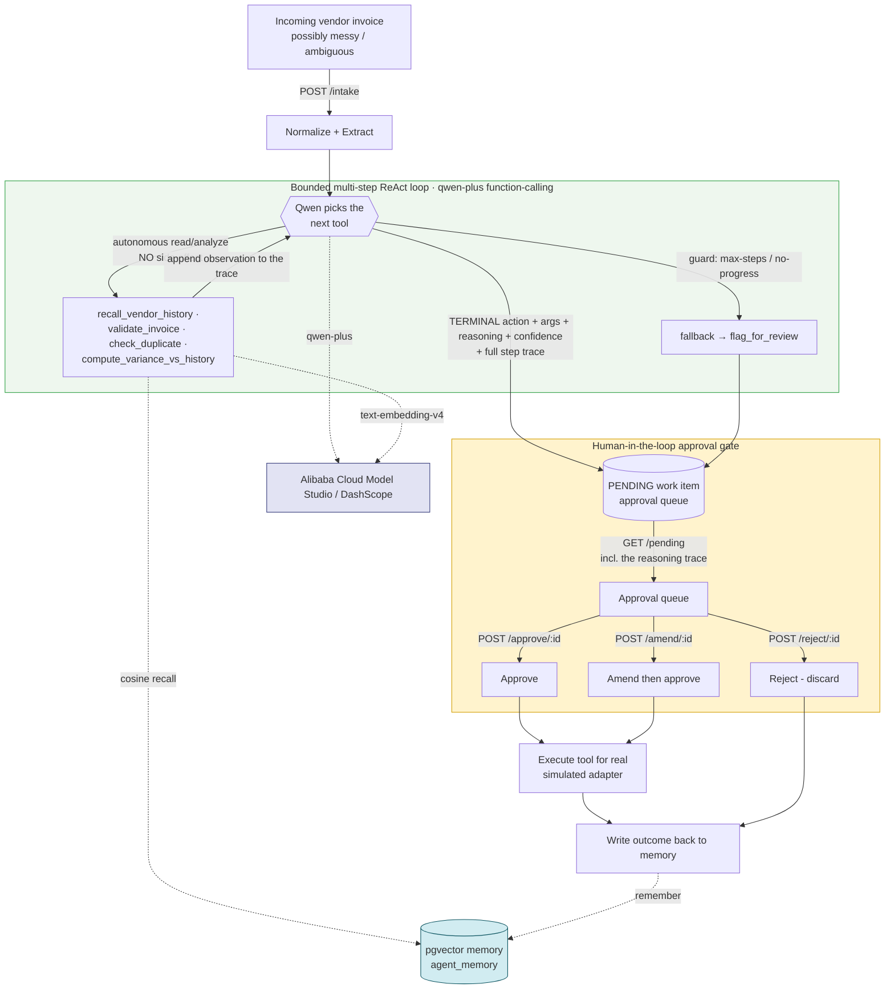

# Archon Autopilot — a human-gated accounts-payable agent (Qwen · Track 4)

Archon Autopilot is a **human-gated accounts-payable (AP) agent**. For each
incoming vendor invoice it runs a **bounded multi-step ReAct loop** over **Qwen
function-calling**: the agent autonomously **recalls the vendor's history**,
**validates**, **checks for a duplicate**, and **computes the amount variance** —
each a read/analyze step with no side-effect — and only then proposes **one**
terminal AP action. **Nothing executes until a human approves the exact arguments**
(the human-in-the-loop gate). It runs the AP workflow from a messy incoming invoice
to a *proposed* action automatically, then stops and waits for a person. It
recommends; it never auto-executes.

> **Scope, stated honestly.** The decision engine is a **genuine bounded ReAct
> loop** (observe → decide → act → observe): the read/analyze tools and the
> memory grounding are **real**. The terminal execution **sinks are simulated
> in-memory adapters** (ledger / payment-rail / SMTP) behind real interfaces — no
> ERP, bank, or mail server is contacted. **Live Qwen is wired** (real `qwen-plus`
> function-calling + `text-embedding-v4`); the whole loop is **verified offline via
> deterministic Fakes** so it runs in CI with no key. Decision quality is
> **measured** — see [Decision-quality eval](#decision-quality-eval) and
> [`EVAL.md`](EVAL.md).

It is the **Track-4 (Autopilot Agent)** entry for the Global AI Hackathon Series
with Qwen Cloud, and it is the **top layer on top of our Track-1 [Archon
MemoryAgent](../qwen-memoryagent)**: the autopilot uses a persistent, queryable
**pgvector memory** as its foundation, so every decision is grounded in what the
agent has learned about a vendor across sessions, and every executed outcome is
written back so the agent gets smarter over time.

> **Positioning:** universal financial-intelligence terms only. `tax` / `tax_id`
> are generic accounting fields, not tied to any national scheme or authority.

---

## The AP workflow (a bounded multi-step ReAct loop)

1. **Intake** — `POST /intake` with an incoming vendor invoice (structured JSON,
   but fields may be missing, mistyped, or ambiguous — real emails/PDFs are messy).
   The invoice is normalized (alias keys, string amounts, EU number formats,
   inferred totals), recording every coercion.
2. **Observe → decide → act → observe (the loop)** — `qwen-plus` is given the
   invoice + every observation gathered so far + the tool catalog, and repeatedly
   chooses the **next tool**. The **autonomous read/analyze tools** run *inside* the
   loop with **no side-effect**, so the agent genuinely reasons over several
   observations before it acts (e.g. recall history → see the prior amount → compute
   the variance → conclude it is anomalous → flag it). It always recalls the
   **MemoryAgent** foundation for this vendor and validates before deciding.
3. **Terminal action → PENDING** — once the model has enough evidence it chooses
   exactly **one terminal, side-effecting action**. The loop **stops** and persists
   the proposal **plus the full step trace** as a **PENDING** work item. Nothing
   executes. Loop guards (a max-steps cap + no-progress detection) fall back to a
   safe `flag_for_review` if it cannot reach a confident action, logging why.
4. **Human-in-the-loop checkpoint** — a human approves, amends, or rejects the
   proposal. This "recommend, never auto-execute" gate is the core Track-4 story;
   the `/pending` payload and the approval UI show the **whole reasoning trace**, so
   a person sees *how* the agent decided, not just the final action.
5. **Execute + remember** — on approval the chosen tool runs for real (simulated
   adapters that post the journal entry / record the payment / "send" the vendor
   reply / raise a review) and the outcome is **written back to memory**.

### Two tool tiers — this is what makes the loop both multi-step AND safe

**Autonomous read/analyze tools — execute INSIDE the loop, no human gate** (no
external side-effect, so the agent can chain several of them):

| Tool | What it does | Rule |
|---|---|---|
| `recall_vendor_history` | pgvector recall of the vendor's prior invoices; surfaces raw **facts** (prior refs, amounts, dates, the amount ratio) — it decides nothing | — |
| `validate_invoice` | structural cross-checks: amount sanity, required fields, tax reconciliation, line-item integrity | **R1–R4** |
| `check_duplicate` | the memory-grounded duplicate finding (needs recall first) | **R5** |
| `compute_variance_vs_history` | the memory-grounded amount-anomaly finding (needs recall first) | **R6** |
| `request_more_context` | record that more information is needed | — |

**Terminal, side-effecting actions — HUMAN-GATED** (choosing one STOPS the loop and
persists a PENDING proposal; nothing runs until a human approves):

| Tool | When the model picks it | Executed side-effect (simulated adapter) |
|---|---|---|
| `draft_journal_entry` | Clean, validated invoice from a **new** vendor | Posts a balanced debit-expense / credit-AP entry to the ledger |
| `draft_payment` | Clean invoice from a **known, recurring** vendor, amount in range | Records a scheduled payment on the payment rail |
| `draft_vendor_reply` | Required fields missing or the invoice does not reconcile | "Sends" a clarification request to the vendor (Fake email sink) |
| `flag_for_review` | Confirmed **duplicate** or **anomalous amount** | Escalates the invoice to a human specialist |

Each tool is a real OpenAI-compatible **function schema** handed to Qwen. On the
terminal action the model self-reports a `reasoning` and a `confidence`; the loop
lifts those out of the tool arguments so the **domain args a human approves are
exactly the args that execute** (the HITL integrity guarantee). The R1–R6 rule set
is split across the analyze tools by data dependency: R1–R4 need no memory, while
R5/R6 need the history `recall_vendor_history` fetches first.

---

## Architecture



**Stack (consistent with Track 1):** TypeScript · Node ≥20 (ESM) · Fastify 5 ·
the `openai` SDK against Alibaba Cloud Model Studio / DashScope (`qwen-plus` for
reasoning + **function-calling**, `text-embedding-v4` for memory) · `pg` +
pgvector for persistent memory and the approval queue.

---

## Track-4 pillars it hits

- **Ambiguous input** — invoices arrive messy; `normalize.ts` coerces alias keys,
  string amounts (`"€ 2.500,00"`), bad dates, and missing fields into a clean
  record, recording every inference; validation flags what it cannot fix.
- **Tool-use (multi-step agentic loop)** — a real function-calling tool set across
  two tiers; `qwen-plus` runs a bounded ReAct loop, chaining autonomous read/analyze
  tools (recall → validate → check_duplicate / compute_variance) before choosing one
  terminal action. The **same** `tool_calls`-parsing code path runs online (real
  Qwen) and offline (a canned `FakeQwenChatClient` that scripts a genuine multi-step
  trajectory at the client seam), so the integration is genuinely exercised in CI.
- **Human-in-the-loop** — nothing executes during the loop (the autonomous tools
  never touch a side-effect sink) or at intake. Proposals wait in a durable approval
  queue *with their full reasoning trace*; approve / amend / reject are explicit
  human acts, and the amended args are exactly what runs.
- **Production-readiness** — injectable dependencies, an offline-first design
  (zero credentials, zero spend in CI), the full testing pyramid, gitleaks +
  dep-audit in CI, swagger docs, a Dockerfile + compose, and a deploy note for
  Alibaba Cloud ECS / Function Compute + ApsaraDB RDS for PostgreSQL (pgvector).

---

## How it layers on the Track-1 MemoryAgent

The Track-1 [Archon MemoryAgent](../qwen-memoryagent) is a persistent, queryable,
cross-session memory built on Qwen + pgvector. Archon Autopilot **reuses that
foundation directly**: the same `Embedder` seam (real `text-embedding-v4` vs. an
offline `FakeEmbedder`), the same pgvector `MemoryStore` pattern (real vs.
in-memory), and the same "auto-select real Qwen vs. deterministic Fakes by
environment" design. Where the MemoryAgent *answers questions* from memory, the
Autopilot *acts* on memory: it recalls a vendor's history to ground a decision,
then remembers the outcome so the next invoice is judged with more context. Track
1 is the memory; Track 4 is the human-gated agent that reasons over it and acts
only once a person approves.

---

## Quickstart

```bash
npm install

# 1) Fully offline — no key, no database. Drives four invoices through the whole
#    loop (journal entry, payment, vendor reply, flagged duplicate).
npm run demo

# 2) The test suite (unit + the offline HTTP integration slice). Green on a bare
#    clone; the pgvector DB tests skip automatically when DATABASE_URL is unset.
npm test

# 3) Run the API (offline Fakes when DASHSCOPE_API_KEY is unset; in-memory stores
#    when DATABASE_URL is unset). Swagger UI at http://localhost:9000/docs
npm start
```

With a database + real Qwen:

```bash
cp .env.example .env         # set DASHSCOPE_API_KEY + DATABASE_URL
docker compose up -d db      # a local pgvector container
npm run db:schema            # create agent_memory + ap_workitems
npm start
```

Drive the loop by hand:

```bash
# Intake a messy invoice → a PENDING proposal (nothing executes)
curl -s -X POST localhost:9000/intake -H 'content-type: application/json' \
  -d '{"invoice":{"supplier":"Contoso Ltd","amount":"€ 1.200,00","invoice_number":"CO-42","tax_id":"TX-1","subtotal":1000,"tax":200,"total":1200}}'

curl -s localhost:9000/pending                 # the approval queue
curl -s -X POST localhost:9000/approve/<id>    # execute for real
```

---

## Live

The Autopilot deploys onto the **same Alibaba Cloud ECS box** as the Track-1
MemoryAgent, **reusing that box's pgvector** (its own `autopilot` database), served
on host port **9100** (the MemoryAgent holds 9000):

- **Approval UI:** http://43.106.13.19:9100/ — the browser approval queue (review
  each Qwen-proposed action + its reasoning + arguments, then approve / amend /
  reject). Also at `/ui`.
- **Health:** http://43.106.13.19:9100/health
- **API docs:** http://43.106.13.19:9100/docs

Reproduce it with one command on the box (idempotent, schema-first, fail-closed,
health + intake/pending smoke):

```bash
ssh -i <key.pem> root@43.106.13.19
cd /root/autopilot && git pull
bash deploy/redeploy.sh
```

It joins the MemoryAgent's docker network, reuses its pgvector container in a
separate `autopilot` database, builds + serves the backend on 9100, and proves the
round-trip. Full runbook, the reuse-pgvector decision, and the one security-group
rule to open (port 9100) are in [`deploy/DEPLOY_STATE.md`](deploy/DEPLOY_STATE.md).

> The public URL depends on a human opening port 9100 on the box's security group
> and running `deploy/redeploy.sh` — see the deploy state doc.

---

## The approval UI

`GET /` (and `/ui`) serves a single, dependency-free static HTML+JS page from the
**same Fastify backend** — no framework, no build step. It loads `GET /pending` and,
for each proposal, shows the vendor, amount, the Qwen-proposed tool + reasoning +
confidence, the **agent's step-by-step reasoning trace** ("How the agent decided" —
each autonomous read/analyze step and what it observed, so a human sees *how* the
proposal was reached), the editable action arguments, the validation findings, and
the recalled vendor history. Each item wires **Approve** (`POST /approve/:id`), **Amend & approve**
(edit the arguments inline → `POST /amend/:id`), and **Reject** (`POST /reject/:id`)
to the real endpoints, with a success toast and an automatic queue refresh after each
action. It is same-origin, so it needs no configuration.

---

## Endpoints

| Method + path | Purpose |
|---|---|
| `GET /` · `GET /ui` | The human approval UI (static page served by this backend). |
| `GET /health` | Liveness + the live embedder / decision-model ids. No DB, no key. |
| `POST /intake` | Ingest a vendor invoice → normalize → run the multi-step ReAct loop (recall → validate → check duplicate / compute variance) → a **PENDING** proposed action + its full step trace. Nothing executes. |
| `GET /pending` | The human approval queue (proposals awaiting a decision), each including its reasoning trace. |
| `POST /approve/:id` | A human approves → the chosen tool executes for real; the outcome is written back to memory. |
| `POST /amend/:id` | A human edits the proposed domain args, then approves → the **amended** args are exactly what execute. Body: `{ args, reason? }`. |
| `POST /reject/:id` | A human discards the proposal → nothing executes. The rejection is remembered. Body: `{ reason? }`. |
| `GET /docs` · `GET /openapi.json` | Interactive Swagger UI + the raw OpenAPI 3 spec. |

**Approval-gate semantics:** an unknown work-item id → `404`; an already-decided
item (approved/rejected) → `409` (it can never be re-executed).

---

## Testing & CI

The suite is the full pyramid, offline-first:

- **Unit** — normalizer, R1–R6 validation, the terminal tool schemas + execute
  stubs, the autonomous read/analyze tools (`analysis-tools.test.ts`), the
  multi-step ReAct loop (`loop.test.ts` — the genuine multi-step trajectory, the
  real `tool_calls` parse path via a canned client and the `FakeQwenChatClient`, and
  the max-steps + no-progress guard fallbacks), the workflow state machine +
  approval gate (including the "≥2 autonomous steps, nothing side-effecting fires"
  invariant), and the HTTP shell.
- **Integration** — the **mandatory** offline slice drives `intake → pending →
  approve → executed` over HTTP with in-memory injection (no DB, no key), plus a
  real pgvector store round-trip that runs against the CI service container and
  **skips automatically when `DATABASE_URL` is unset**.

CI (`.github/workflows/ci.yml`): **gitleaks** (pinned v8.18.4) → **dep-audit**
(`npm audit`, fails on high/critical) → **typecheck** → **build** (`tsc`) →
**test** → **demo smoke** → **decision-quality eval gate** — all with no
`DASHSCOPE_API_KEY`, so the whole agent runs on the deterministic Fakes.

---

## Decision-quality eval

The eval turns "the agent proposes actions" into a **measured number**. A labelled
set of **22 AP scenarios** (`eval/dataset.ts`) — clean new-vendor, clean recurring
vendor, missing/unreconciled fields, suspected duplicate, amount anomaly,
ambiguous/messy input, and signal-precedence collisions — each carries the tool a
human AP clerk would deem correct (**business ground truth**, never traced from the
Fake's policy). The runner drives the **real multi-step loop** (normalize → recall
vendor history → validate R1–R4 → check_duplicate R5 / compute_variance R6 as the
evidence warrants → terminal action) and grades **tool-choice accuracy**. Because
every scenario now runs the loop, it also reports **loop autonomy** — how many
autonomous steps ran before the terminal action:

```bash
npm run eval            # drive every scenario, print the table + accuracy N/M
npm run eval -- --gate  # CI gate: fail if accuracy < the floor
```

- **Offline (deterministic Fakes, gated in CI):** **21 / 22 (95.5%)** tool-choice
  accuracy, with **every one of the 22 scenarios taking ≥2 autonomous read/analyze
  steps** (avg 2.3) before the terminal action — a **policy / regression** guard
  over the real multi-step pipeline. The single miss (`s22`) is a **documented,
  deliberately-surfaced limitation**, not a hidden failure: a no-parseable-total
  invoice is surfaced as an R1 observation but the deterministic policy has no
  routing branch for it, so it falls through instead of drafting a vendor query. The
  eval reports it rather than labelling around it.
- **Online (real `qwen-plus`, run with a key):** the actual **decision-quality**
  number — the model choosing freely against the same labels. Set
  `DASHSCOPE_API_KEY` and re-run `npm run eval`; the header self-labels the run
  `ONLINE` and prints the live model ids.

Method, honesty caveats, and the offline/online split: [`EVAL.md`](EVAL.md).

---

## Current scope and follow-ups

Stated plainly (see also the Scope note up top):

- **Terminal sinks are simulated adapters.** `draft_journal_entry` / `draft_payment`
  / `draft_vendor_reply` / `flag_for_review` record what *would* happen to
  inspectable in-memory Fakes behind real interfaces; the `Sinks` interfaces are the
  drop-in seam for real ledger / payment-rail / SMTP adapters. No ERP, bank, or mail
  server is contacted. **The loop and the autonomous read/analyze tools + memory
  grounding are real** — only the terminal side-effects are simulated.
- **Deferred:** actual Alibaba Cloud deployment (ECS / Function Compute + ApsaraDB
  RDS for PostgreSQL, see [`deploy/DEPLOY_NOTE.md`](deploy/DEPLOY_NOTE.md)); and the
  real Sinks adapters above.

## License

MIT — see [LICENSE](LICENSE).
